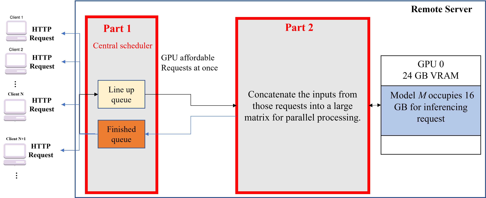

# Batch Parelle AI Serving

This repo is to Replicate Ollama serving by our own understanding.




**maybe all of them are wrong at all**

it is just the project for our course while we are fxcked by our professor who asking us to do lots of projects at the same period.
  - i.e. We don't have the fxcking time to research it.

## python backend 
Refer to [server_with_queue.py](./server_with_queue.py)
  - asycio
  - unicorn

## Llama inference script:
Refer to [llm.py](./llm.py)
  - Hugging Face
    - pytorch framework
  - pretrained weights : 
    - [Llama3-TAIDE-LX-8B-Chat-Alpha1](https://huggingface.co/taide/Llama3-TAIDE-LX-8B-Chat-Alpha1) 
    - quantize to 8bit
     

## A test reqeust:
- Windows Powershell:
  ```
  curl -Uri "http://127.0.0.1:8000/inference" -Method POST -Body '{"request": "幫我用 c 語言寫 hello world"}' -ContentType "application/json"
  ```

## Current usage
Please go to above link : https://huggingface.co/taide/Llama3-TAIDE-LX-8B-Chat-Alpha1 to download the pretrained weights and configs
- It will be a directory named ```Llama3-TAIDE-LX-8B-Chat-Alpha1```, please put it at the same directory as this project

-  The file tree of this project should look like this:
  ```
  .
  ├── readme.md
  ├── llm.py
  ├── server_with_queue.py
  ├── simulation.py(optional)
  └── Llama3-TAIDE-LX-8B-Chat-Alpha1/
      ├── config.json
      ├── generation_config.json
      ├── model-.....safetensors
      ├── ...
      └── tokenizer.json
  ```

### start server: 
```python server_with _queue.py```

### Doing simulation:
```python simulation.py``` 